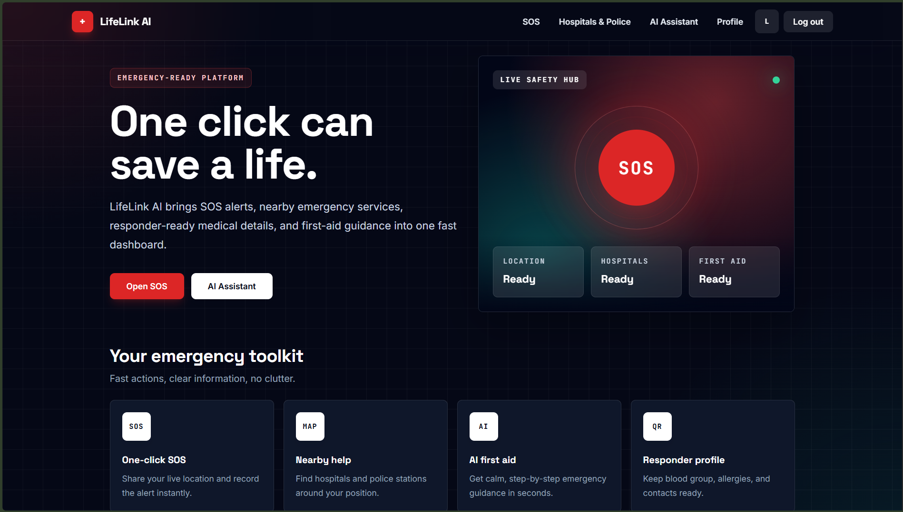

<div align="center">

# 🚑 LifeLink AI

### AI-Powered Smart Emergency Response System

**"One Click Can Save a Life."**

<p align="center">
  
</p>


</div>

---

## 🌍 Overview

LifeLink AI is a full-stack AI-powered emergency response platform built to provide immediate assistance during critical situations.

The platform combines **AI-powered first-aid guidance**, **one-click SOS alerts**, **nearby hospitals & police station locator**, and **secure JWT-based authentication** into one modern, responsive application.

Its goal is to reduce emergency response time by helping users quickly access emergency services and life-saving information when every second counts.

---

## 🌐 Live Demo

> 🚀 Frontend: Coming Soon

> ⚙️ Backend API: Coming Soon

---

## ✨ Features

### 🚨 Emergency Response

- One-click SOS with live GPS location
- Interactive emergency map
- Nearby hospitals
- Nearby police stations

### 🤖 AI Medical Assistant

- Google Gemini AI integration
- CPR guidance
- Choking assistance
- Burn treatment
- Bleeding control
- General first-aid instructions

### 🔐 Security

- JWT Authentication
- Secure Login & Signup
- Protected Routes

### 👤 Emergency Profile

- Blood Group
- Allergies
- Emergency Contact
- QR Code Profile

### 🎨 User Experience

- Responsive UI
- Dark Mode
- Modern Design
- Fast Performance

---

## 📸 Preview

<p align="center">
  
</p>

---

## 🛠 Tech Stack

| Layer | Technology |
|--------|------------|
| Frontend | React, Vite, Tailwind CSS, React Router |
| Backend | Node.js, Express.js |
| Database | MongoDB Atlas |
| Authentication | JWT |
| AI | Google Gemini API |
| Maps | Leaflet, OpenStreetMap, Overpass API |

---

## 🏗️ Project Structure

```text
lifelink-ai
│
├── assets
│   └── homepage.png
│
├── client
│   ├── src
│   ├── public
│   ├── package.json
│   └── .env.example
│
├── server
│   ├── controllers
│   ├── routes
│   ├── middleware
│   ├── models
│   ├── package.json
│   └── .env.example
│
├── .gitignore
└── README.md
````

---

## ⚙️ Installation

### Clone Repository

```bash
git clone https://github.com/codewithSAKSHAM-SINGH21/LifeLink-AI.git
```

### Backend

```bash
cd server
npm install
cp .env.example .env
npm run dev
```

### Frontend

```bash
cd client
npm install
npm run dev
```

---

## 🔑 Environment Variables

Create a `.env` file inside the `server` folder.

```env
PORT=5000
MONGO_URI=your_mongodb_connection_string
JWT_SECRET=replace_with_a_long_random_secret
GEMINI_API_KEY=your_gemini_api_key
GEMINI_MODEL=gemini-2.5-flash
GEMINI_API_VERSION=v1
CLIENT_ORIGIN=http://localhost:5173
```

Create a `.env` file inside the `client` folder for local development.

```env
VITE_API_URL=http://localhost:5000/api
```

---

## Deployment

Deploy the backend first, then use its live HTTPS URL when building the frontend.

### Backend

1. Deploy the `server/` directory to Render, Railway, Fly.io, or another Node host.
2. Use `npm start` as the start command.
3. Set these backend environment variables in the hosting dashboard:
   - `MONGO_URI`
   - `JWT_SECRET`
   - `GEMINI_API_KEY`
   - `CLIENT_ORIGIN` with your deployed frontend origin, for example `https://your-app.vercel.app`
4. In MongoDB Atlas, allow your deployed backend to connect under **Network Access**. For dynamic cloud hosts, use `0.0.0.0/0` only if that matches your security requirements.

### Frontend

Set `VITE_API_URL` before building the Vite app:

```env
VITE_API_URL=https://your-backend-url.onrender.com/api
```

Important deployment notes:

- The value must include `/api`.
- Use `https://` when the frontend is served over HTTPS.
- Vite injects `VITE_*` variables at build time, so redeploy/rebuild the frontend after changing `VITE_API_URL`.
- Production builds fail fast if `VITE_API_URL` is missing to avoid shipping a bundle that calls `localhost`.

---

## 🚀 Roadmap

* Multi-role login (Hospital, Police, Ambulance & Admin)
* Blood Donor Module
* Organ Donor Module
* Volunteer Registration
* Voice Activated SOS
* SMS Emergency Alerts
* Progressive Web App (PWA)
* Offline Emergency Support
* Multi-language Support
* Analytics Dashboard
* Incident Heatmaps

---

## 🎯 Purpose

LifeLink AI demonstrates how artificial intelligence and modern web technologies can work together to improve emergency response systems through faster access to medical guidance, emergency services, and personal emergency information.

---

## ⚠️ Disclaimer

This project was developed for educational and portfolio purposes.

The AI assistant provides general first-aid guidance only and should **not** replace professional medical advice or emergency services.

---

## 👨‍💻 Author

**Saksham Singh**

B.Tech Computer Science Engineering

Shri Mata Vaishno Devi University

GitHub:
https://github.com/codewithSAKSHAM-SINGH21

---

<div align="center">

⭐ If you found this project helpful, consider giving it a **Star**.

Made with ❤️ using React, Node.js, MongoDB Atlas & Google Gemini AI

</div>
```

